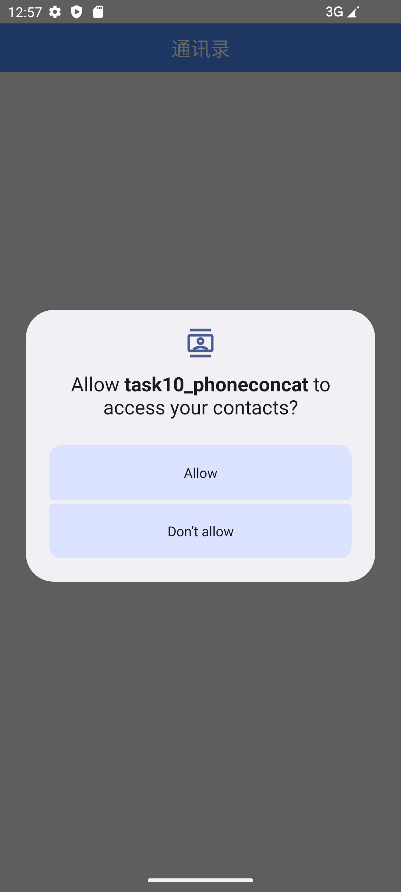
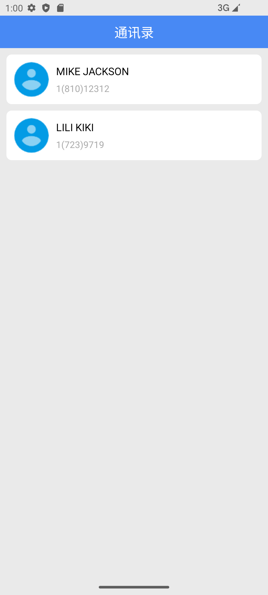

# android_task
This project includes several basic examples of Android, which come from the 《Android移动开发基础教程》.

## preview

Here are some preview images as follows.

### 1.helloworld

### 2.music player

technology point: Relative Layout

### 3.calculator

technology point: Table Layout

### 4.register

technology point: Form Interaction

### 5.shopping cart

technology point: List Layout

### 6.pick peach

technology point: Multi-Activity

### 7.meituan menu

technology point: Fragment

### 8.qq save

technology point: SharedPreferences storage.

### 9.address book

technology point: SQLite database, SQL.

### 10.phone concats

technology point: Content Provider, Conent Resolver.

