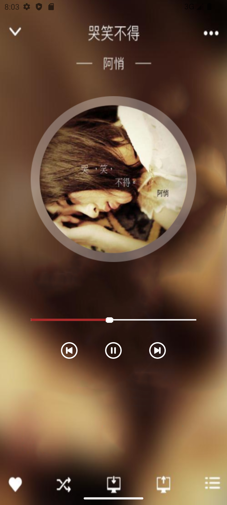
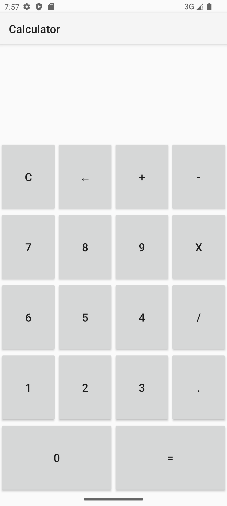
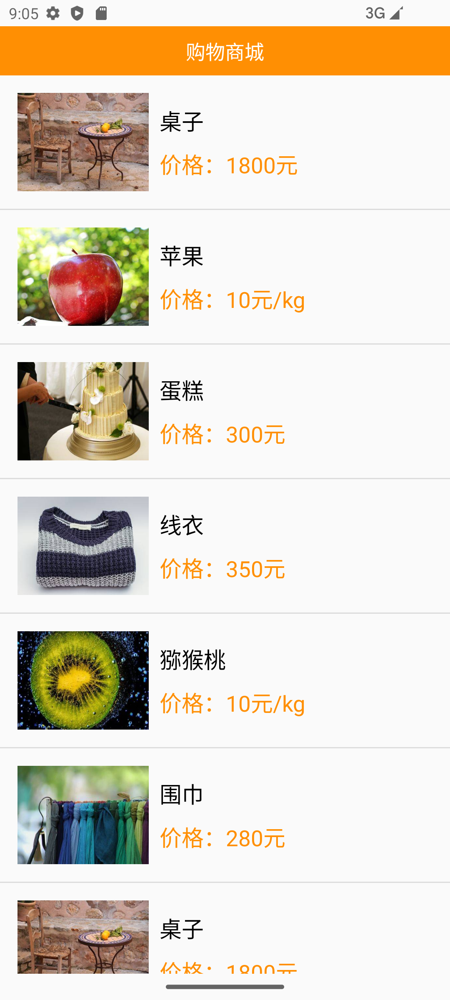
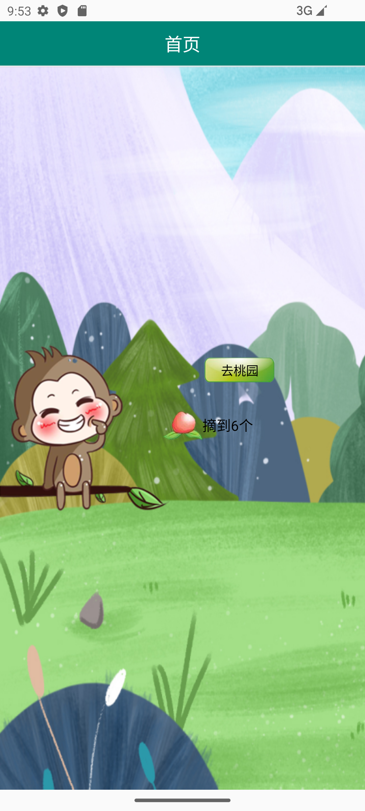
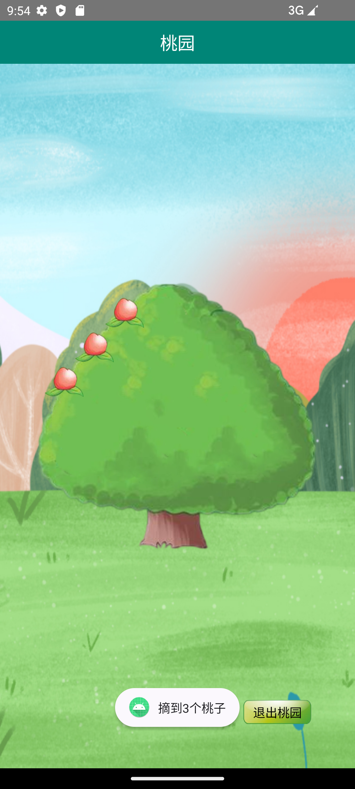
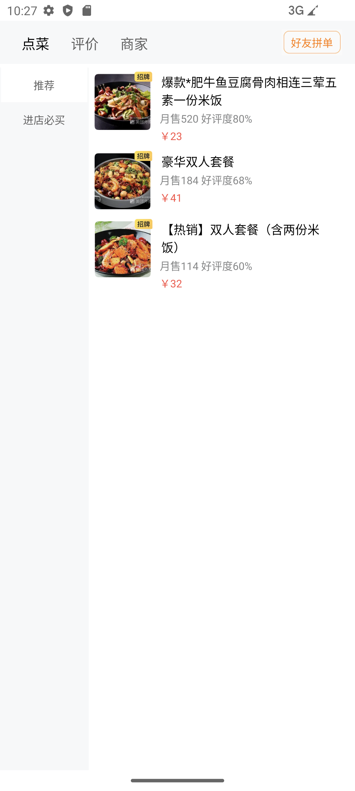
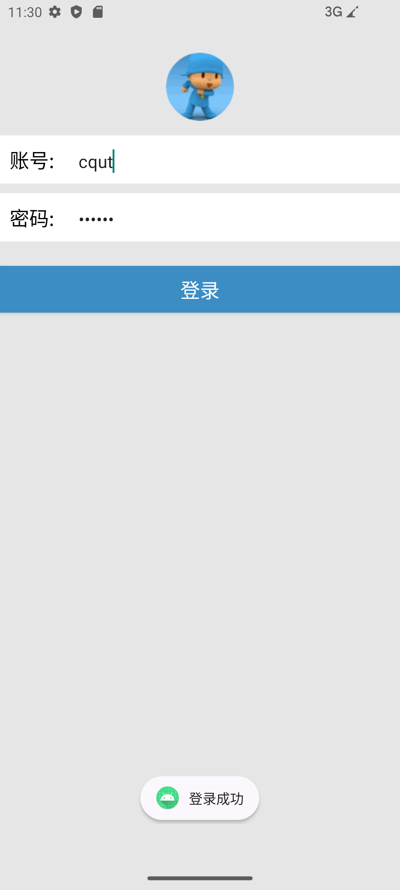

# android_task
This project includes several basic examples of Android, which come from the 《Android移动开发基础教程》.

## preview

Here are some preview images as follows.

### 1.helloworld

### 2.music player

### 3.calculator

### 4.register

### 5.shopping cart

### 6.pick peach

### 7.meituan menu

### 8.qq save

